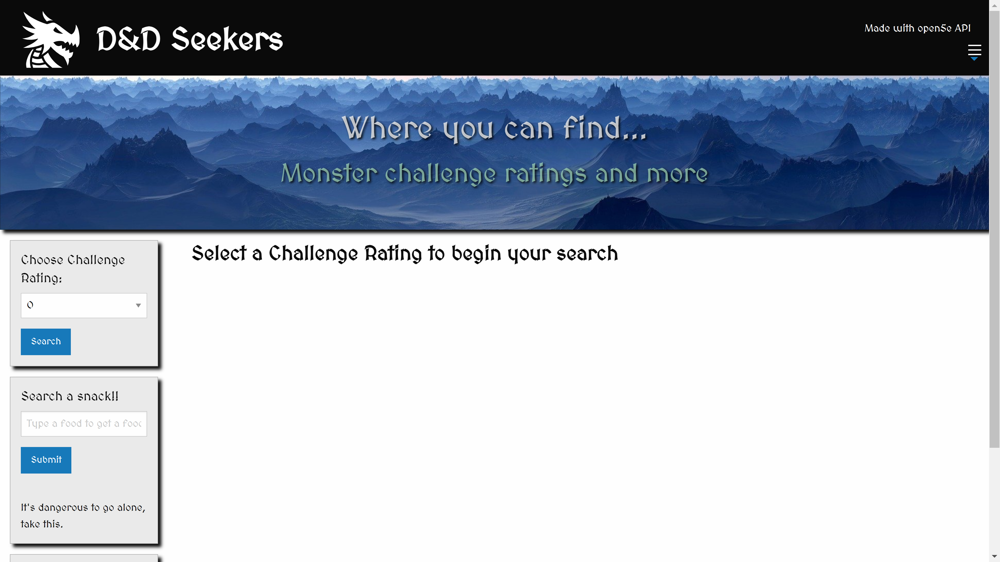
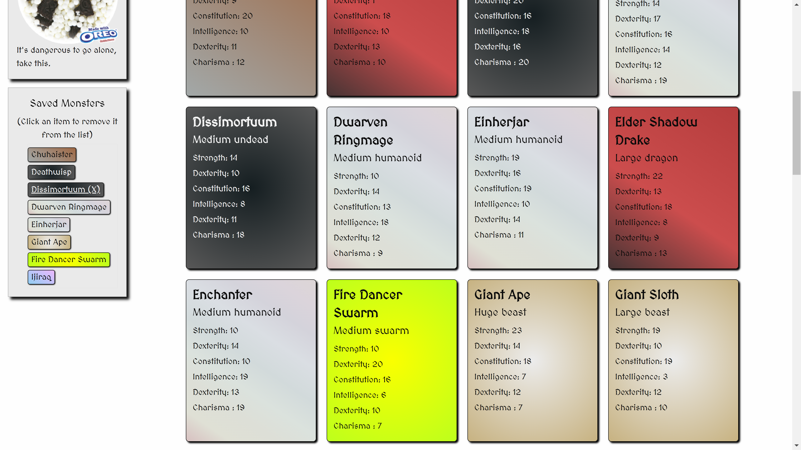

# D&D Seekers
D&D Seekers is a Dungeons and Dragons monster search application that allows people to search for monster challenge ratings and receive a random snack based on user input.

## Introduction:
Before or during a game, it is often helpful know how great a threat a monster is to determine whether the party is appropriately equipped for the encounter. This application allows players to seek out information that will help them gain an edge in battle.

## Collaborators:
* **Ben Martin** - The great wizard of the glade. The code is strong with this one. Always willing to lend a helping hand in our fierce battle. His quick-wittedness and powers in JavaScript brought us to victory.

* **Grant Royseth** - The valiant knight of the shade. Well-known for his ability to adapt and defend against the darkness of APIs. He was summoned to answer the threat of API.

* **Nick Mullenmeister** - The dreamer of the lost. Happens to know a thing or two about JavaScript and CSS, but often finds himself mystified. Does his best though. Could someday become a coding sorcerer.

* **Bailey Behning** - The lady of the realm. Fights for our cause, the sake of coding, and the betterment of all coders.

## User Story
As a DM (Dungeon Master) of Dungeons & Dragons:
* I want to be able to quickly and easily look up monsters I can use for my encounters.
* I want to tell at a glance what type the creature is.
* I want to know its ability scores (Strength, Dexterity, etc.).
* I want to be able to make a list of monsters I'm considering using.
* I want my list to be saved between sessions.
* I want to be inspired by pictures of delicious food.

## General Information:
Upon making a successful search, users are presented with monster cards that contain the following information: monster name, monster challenge rating, monster type, and ability scores. Users may also type in their favorite snack to get a random snack under that category that they can use to further enhance their D&D experience. You can't play D&D without snacks.

## Our Two API's:
* [Open5e](https://open5e.com) - A Dungeons and Dragons open-source resource that includes all mosnters, spells, and more from the 5th edition of D&D. 
* [spoonacular API](https://spoonacular.com/food-api) - An API that provides a random snack based on user text input.

## Future Features:
Our group has brainstormed several additional features that could be added to the application:
* When a user hovers over a saved creature, that monster's card is displayed.
* Each monster's card has a button which when clicked displays the monster's full data.
* Checkboxes could be included that would allow users to narrow down the source books that the search pulls from (e.g. just the base game, or filter for certain expansion books).

## Technologies Used:
1. HTML
2. CSS
3. JavaScript and jQuery
4. Two server-side APIs
5. Foundation CSS Framework (https://get.foundation/)
6. Google Fonts

## Built with:
1. Visual Studio Code
2. Chrome DevTools
3. Insomnia (used for checking APIs)
4. Git Bash and Github
5. Markdown

## Screenshots and GIF:

## Image Sources:

planet-g811dbd317_1920-pixabay - https://pixabay.com/illustrations/planet-sience-fiction-fantasy-world-1702788/

spiked-dragon-head - https://game-icons.net/1x1/delapouite/spiked-dragon-head.html

## GitPages Link:

You can find our website here:

https://the-wake.github.io/project-1-dnd/
